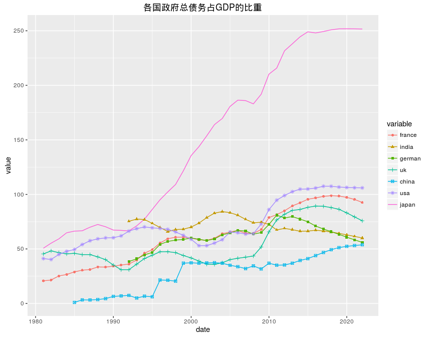
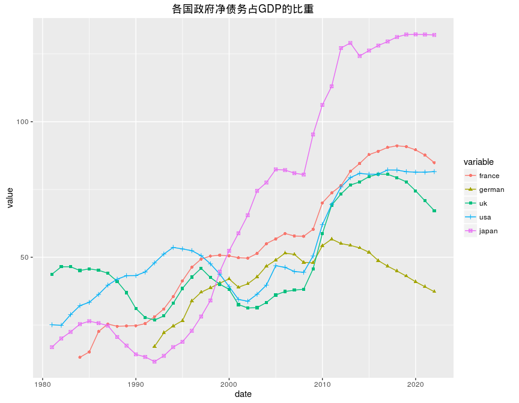
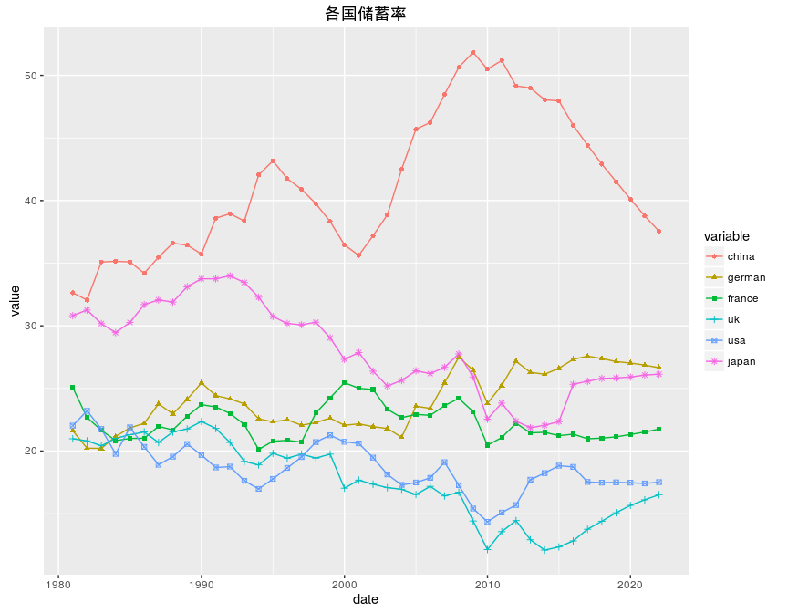

# public fiance
qiufei  
2016-06-07  

# 政府债务占GDP的比重 #

## 总债务 ##

## 净债务 ##

出去日本,在2009年以前,各主要发达国家政府净债务占GDP的比重运行轨迹保持一致,基本在50%以下.

2009年后,除德国的政府净债务比重没有发生较大变化之外,主要发达国家政府净债务比重快速上升.

# saving rate #

中国储蓄率在2000年跌倒谷底(跌回80年代水平),到2009年达到高峰,目前一路下降,预测也是持续下降到2022年,回到2000年的水平(35.6%).

